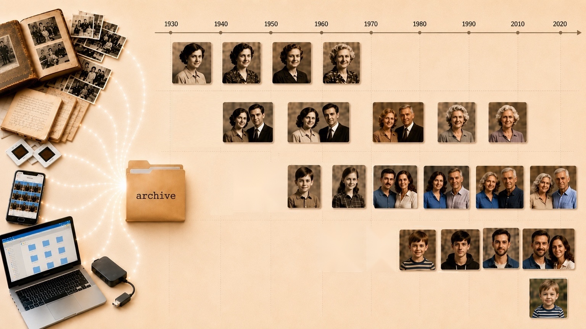

# 2026-05-22 Личный архив: сбор, бэкап, таймлайн фотографий

Мой цифровой архив — сканы документов, медицинские снимки, фотографии, видео и аудиозаписи — годами копился в разных местах: на старом и новом компьютерах, в телефоне, облаках и соцсетях. В каждом месте — какая-то часть, а где-то дубликаты. В [одной из прошлых статей](https://habr.com/ru/articles/1024824/) я уже рассказывал, как собрал все заметки в одно место, теперь пришло время для остального.

На первом этапе главным был вопрос "насколько сильно хочется заморочиться". Ответ был простым: "не хочется вообще". Когда задача требует отдельной инфраструктуры — своего self-hosted сервиса — большинство людей просто не делает ее никогда. Архив остается в том же состоянии, потому что "как-нибудь потом, когда будет время и силы разобраться". Главная цель — сделать достаточно просто, чтобы это можно было сделать с минимумом когнитивных усилий и технической экспертизы. Хотелось:

- собрать архив в одно место,

- диверсифицировать бэкап по разным юрисдикциям,

- по возможности на базе облачного бэкапа получить таймлайн фотографий, который можно расшарить в режиме ридонли.

Сделать это можно постепенно, без подвигов за несколько вечеров. Теперь о каждом этапе подробнее.

## Сбор и оптимизация

Первый этап — буквально перенести все в одну локальную папку `archive`, разделенную на несколько категорий. Эта папка становится единственным источником правды.

Сразу важная оговорка про фотографии. Фотоархив у меня — это не место для профессиональной работы с изображениями, а триггер воспоминаний. Поэтому все фотографии я привел к одному стандарту: не более 2k по большей стороне. Также можно проверить процент сжатия, многие фотки имели не совсем адекватный разрешению вес. Учитывая ежегодный рост размеров фоток, такой формат удерживает архив в адекватных пределах. Даже можно уложиться в бесплатные облачные тарифы со своими тысячами фоток.

## Бэкап

К сожалению, сегодня полагаться на какой-то один облачный сервис ненадежно. Санкции, блокировки, потенциальная релокация — реальные сценарии, в которых конкретный сервис в один день окажется недоступен или вообще удалит все содержимое. РФ, не РФ — риски с обеих сторон.

Поэтому требования к бэкапу получились такие. Во-первых, копии должны лежать в разных юрисдикциях: одна внутри страны, другая снаружи. Во-вторых, синхронизация — ручная, а не автоматическая на каждое изменение в архиве.

Инструмент — `rclone`. Это утилита командной строки, которая умеет работать с большинством облачных провайдеров. Настраиваешь один remote на Google Drive, второй на Яндекс Диск, дальше одной командой синхронизируешь облако с локальной папкой. Настройка пары remotes — минут десять, дальше одна команда на синхронизацию. Важна архитектура: локальная папка — "источник правды", облака — резервные копии.

Если хочется, можно еще использовать офлайн‑накопитель с паролем. `rclone` это позволяет. Будет ближе к стандарту с 3-мя копиями.

На этом этапе уже неплохо. Архив собран в одно место, оптимизирован по размеру и имеет более или менее надежный резерв.

## Таймлайн фотографий

Я знал, что у Яндекс Диска есть фича с фото-таймлайном, как в галерее телефона. Но с первой попытки было не все гладко: что-то не попало, что-то отображалось под неверной датой. Оказалось, индексация картинок делается по EXIF-метаданным.

Проблема в том, что у меня фотографии из трех разных источников:

- **Перефотканное с бумажных альбомов.** Год известен не всегда точно — по возрасту людей на снимке, по подписям на обороте. Вытаскивание этих данных невозможно автоматизировать.

- **Архив 15–20-летней давности.** Эпоха перехода с пленки на цифру, разные камеры, часть файлов с EXIF, часть без.

- **Современные фотографии.** В основном с EXIF, но в архиве оказались и снимки без него — пересохраненные через мессенджеры, скачанные из соцсетей.

Сначала казалось, что это три разные задачи. На самом деле — одна. Структуру фотоархива я не стал менять: как фотки были сгруппированы по событиям, так и остались; но внутри тех папок, где EXIF отсутствовал, я добавил подпапки с датами. Где-то просто год, где-то точнее.

Затем скрипт проходит по всему дереву фотографий: где EXIF отсутствует, подставляет его из имени папки, если оно содержит дату в формате YYYY, YYYY-MM или YYYY-MM-DD. Скрипт мне написал ИИ за пять минут — разбираться с `exiftool` руками не пришлось.

Точность для перефотканных и старых файлов — год, но для таймлайна этого достаточно: в масштабе всей жизни плюс-минус месяцы внутри какого-нибудь лохматого года ничего не решают.

Таймлайн делает с фотографиями то, чего не делает ни один альбом. В обычном альбоме снимки сгруппированы по событиям или по людям. В таймлайне эти детали исчезают, и остается одна ось — время.

При быстром скролле видно, как параллельно идут разные жизни: я расту, родители стареют, бабушка из молодой женщины становится пожилой, а потом ее больше нет. Все это на одной шкале. За секунду можно пролистать десятилетие, и люди стареют буквально на глазах. Этот эффект создает новое ощущение, появляется чувство связности не только своей жизни, но и линий жизни близких и знакомых.

Второй раз один и тот же прием — сначала собрать все в одно место, потом наложить ось времени — дает эффект связности. С [заметками](https://habr.com/ru/articles/1024824/) это было не только удобство создания, но и возможность ретроспективы. С архивом — не только порядок, но и таймлайн фотографий.

## P. S. Привет из 1970-го

Не обошлось без ложки дегтя.

Снимки с датами до 1970 года просто не отобразились. Обидно за бабушек и прабабушек, которых я аккуратно пометил годами 1930–1960-х — на таймлайн они не попали. Я заподозрил тут epoch-time с диапазоном с 1 января 1970-го по 19 января 2038-го. Попробовал задать время дальше верхнего предела и точно — переполнение и возврат в начало века — 2040 год отображается как 1904.

Тот самый Y2038, младший брат Y2K.

Удивительно, что эти грабли никуда не делись. В 2014-м счетчик просмотров Gangnam Style на YouTube переполнил int32 — Google пришлось разово переписывать счетчик на 64 бита. С тех пор прошло двенадцать лет, до 2038-го — чуть больше, и кто-то наверняка обнаружит, что в популярном сервисе timestamp до сих пор хранится как int32.